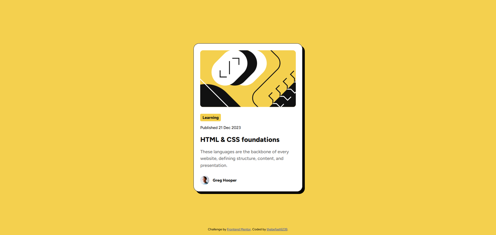

# Frontend Mentor - Blog preview card solution

This is a solution to the [Blog preview card challenge on Frontend Mentor](https://www.frontendmentor.io/challenges/blog-preview-card-ckPaj01IcS). Frontend Mentor challenges help you improve your coding skills by building realistic projects. 

## Table of contents

- [Overview](#overview)
  - [Screenshot](#screenshot)
  - [Links](#links)
- [My process](#my-process)
  - [Built with](#built-with)
  - [What I learned](#what-i-learned)
- [Author](#author)

## Overview

### Screenshot



### Links

- Solution URL: [Add solution URL here](https://github.com/thebefast6239/Blog-Preview-Card)
- Live Site URL: [Add live site URL here](https://thebefast6239.github.io/Blog-Preview-Card)

## My process

### Built with

- Semantic HTML5 markup
- CSS custom properties
- Flexbox
- Mobile-first workflow

### What I learned

Gained skills working with flexbox

```html
<main>Some HTML code I'm proud of</main><footer>I mean semantic</footer>
```
```css
@media (max-width: 1023px){}
```
```css
h1 a:focus-visible {
  outline: 2px solid #F4D04E;
  outline-offset: 4px;
  color: #F4D04E;
}
```
```css
#article-box::before{
    content: "";
    position: absolute;
    top: 0; right: 0; bottom: 0; left: 0; 
    pointer-events: none;

    box-sizing: border-box;
    border-width: 1px;
    border-style: solid;
    border-color: #111111;
    border-radius: 20px;
    /* we made a pseudo-element with ::before, we put it on top using position:absolute, stretched it to our div with top/left/right/bottom=0, made it "transparent" for clicks with pointer-events: none, created empty content: "" for rendering, and then we made default border. */
    /* we have done all this so that our padding works starting from the edges of our "article-box" container, and not starting from the "border" */
}
```

## Author

- Website - [thebefast6239](https://github.com/thebefast6239)
- Discord - [a0s9d8f7g6h5j4k3l2](https://discord.gg)